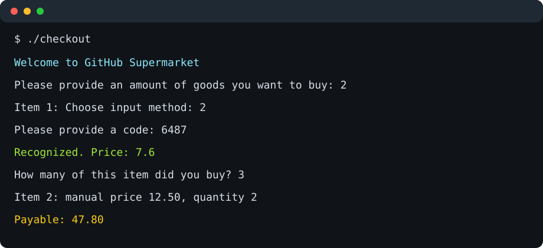

# C++ Mini Projects

Small command-line applications built while practicing C++ fundamentals. Each
folder is a standalone program with its own `main.cpp` and README.



## Projects

| Project | What it demonstrates |
| --- | --- |
| [Calculator](calculator/) | arithmetic operations, `switch`, user input |
| [Checkout System](checkout/) | validation, product code lookup, `vector`, totals and discounts |
| [Day Assessment](day-assessment/) | loops, conditionals, repeated prompts, simple scoring |

## Build and run

Use any C++17 compiler. Example with `clang++`:

```bash
clang++ -std=c++17 -Wall -Wextra -pedantic calculator/main.cpp -o calculator-app
./calculator-app
```

Build another project by replacing the source path:

```bash
clang++ -std=c++17 -Wall -Wextra -pedantic checkout/main.cpp -o checkout-app
clang++ -std=c++17 -Wall -Wextra -pedantic day-assessment/main.cpp -o day-assessment-app
```

## Repository layout

```text
.
├── calculator/
├── checkout/
├── day-assessment/
└── docs/screenshots/
```

## Notes

These are learning projects, intentionally kept small and readable. The code
uses only the C++ standard library and does not require external dependencies.
